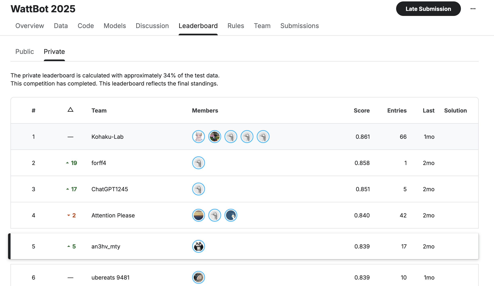

# WattBot 2025 - RAG System for Technical Document Q&A


<!-- WARNING: THIS FILE WAS AUTOGENERATED! DO NOT EDIT! -->

`5th place` solution for the [WattBot 2025 Kaggle
Competition](https://www.kaggle.com/competitions/WattBot2025) - a
Retrieval-Augmented Generation (RAG) system for answering technical
questions from PDF documents.

## Overview

This project implements a RAG pipeline that achieved 5th place on the
private leaderboard (10th on public) in the WattBot 2025 competition.
The system extracts information from technical PDFs, chunks and indexes
the content, retrieves relevant passages, and generates answers using
open-source LLMs.

## Key Features

- **PDF Extraction**: Extraction preserving layout, tables, and images
  using Datalab
- **Hybrid Search**: Combines lexical (BM25) and semantic search with
  reranking
- **Multiple LLM Support**: Integration with
  [Fireworks](https://fireworks.ai/) AI models (DeepSeek v3.1, Kimi
  k2.5, GPT-OSS 20B)
- **Evaluation Framework**: Built-in evaluation using
  [Braintrust](https://braintrust.dev/) platform with WattBot scoring
  metrics
- **Sliding Window Chunking**: Overlapping chunks maintain contextual
  continuity
- **Neighbor Chunk Inclusion**: Retrieves adjacent chunks for better
  context

## Architecture

The pipeline consists of five main stages:

1.  **PDF Extraction** → Content with preserved structure
2.  **Chunking** → Sliding window approach with configurable overlap
3.  **Indexing** → BM25 lexical index + semantic embeddings (Qwen 8B)
4.  **Retrieval** → Hybrid search with Qwen 8B reranker
5.  **Generation** → JSON-formatted answers from open-source LLMs

## Installation

### Clone the repository

``` bash
git clone https://github.com/anubhavmaity/wattbot.git 
cd wattbot
```

### Create and activate environment using uv

``` bash
uv venv
source .venv/bin/activate
```

### Install dependencies using pyproject.toml

``` bash
uv pip install -e .
```

### Install nbdev if not already installed

``` bash
uv pip install nbdev
```

## Configuration

Key parameters to tune:

- **PDF Extraction**: There are various tools to extract content from
  PDF out there like docling, pypdf, datalab etc
- **Chunk Size**: Token/character count per chunk
- **Overlap**: Number of overlapping tokens between chunks
- **Retrieval Count**: Number of chunks to retrieve for
  lexical/semantic/hybrid
- **Reranker Model**: Qwen 8B, Cohere etc
- **LLM Selection**: Closed vs Open source models
- **RRF Parameters**: Weights, window size, k constant

## Evaluation

The system uses the WattBot scoring metric:

``` math
WattBot Score = 0.75 × answer_value + 0.15 × ref_id + 0.10 × is_NA
```

- **answer_value** (75%): Numeric answers within ±0.1% tolerance; exact
  categorical matches
- **ref_id** (15%): Jaccard overlap of reference IDs
- **is_NA** (10%): Correct identification of unanswerable questions

Run evaluations and logged in Braintrust platform for detailed analysis
of chunking strategies, model performance, and retrieval methods.

## Results

- **Private Leaderboard**: 5th place
- **Public Leaderboard**: 10th place
- **Key Insights**:
  - Lexical search (BM25) perfomed better than semantic search
  - Markdown extraction better than text-only extraction
  - Hybrid search with reranking provided best results
  - Neighbor chunk increased accuracy
  - Proprietary models (OpenAI) showed improvements but exceeded budget



## Technical Highlights

### PDF Extraction

Used [Datalab](http://datalab.to/) for markdown extraction (~\$2.02 for
31 PDFs). Preserves layout, tables, and images better than pypdf or
Docling.

### Search Strategy

Started with BM25 lexical search. Added Qwen 8B embeddings for semantic
search. Combined both with reranking model for optimal retrieval.

### Prompting

- Markdown-formatted prompts work best with open-source models
- Explicit instructions preferred over assumptions
- JSON output format for easy parsing
- Tested zero-shot, few-shot, and chain-of-thought approaches

### Chunking

- Character/Token based chunking with overlap
- MarkdownTextSplitter from LangChain with sliding window overlap
  maintained context across chunk boundaries.

## Project Structure

Built with [nbdev](https://nbdev.fast.ai/) for literate programming
approach.

## Lessons Learned

1.  Start with lexical search before jumping to vector embeddings
2.  PDF extraction quality matters more than retrieval sophistication
3.  Evaluation infrastructure is critical for iterative improvement
4.  Prompt engineering is artisanal and requires iteration
5.  Open-source models can achieve competitive results with proper
    tuning

## Acknowledgments

Built using [Solveit](https://solve.it.com/) for development workflow.

Competition organized by Christopher Endemann, Dhruba Jyoti Paul, and
Annie Zhao on Kaggle: [WattBot
2025](https://www.kaggle.com/competitions/WattBot2025)
