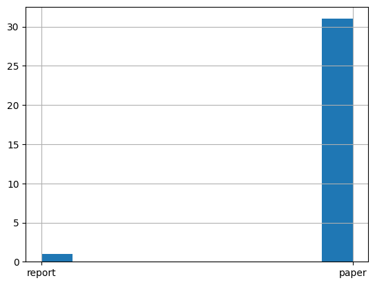
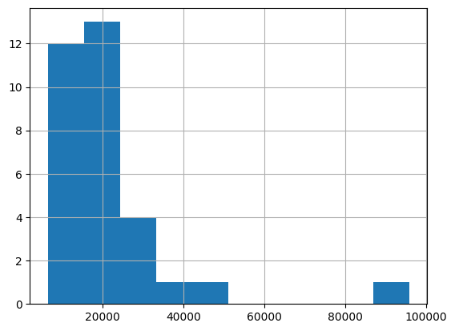

# EDA


<!-- WARNING: THIS FILE WAS AUTOGENERATED! DO NOT EDIT! -->

I participitated in this competition few months back and was ranked
`5th` in the
[Private](https://www.kaggle.com/competitions/WattBot2025/leaderboard?)
Leaderboard and `10th` in the
[Public](https://www.kaggle.com/competitions/WattBot2025/leaderboard?tab=public)
Leaderboard. There were 182 entrants

<figure>

<figcaption aria-hidden="true">Leaderboard Ranking</figcaption>
</figure>

### Looking at data

There are 3
[files](https://www.kaggle.com/competitions/WattBot2025/data) shared in
the competition - metadata.csv - test_Q.csv - train_QA.csv

I have created a folder data and have downloaded all the 3 files into it

``` python
metadata().head()
```

<div>
<style scoped>
    .dataframe tbody tr th:only-of-type {
        vertical-align: middle;
    }
&#10;    .dataframe tbody tr th {
        vertical-align: top;
    }
&#10;    .dataframe thead th {
        text-align: right;
    }
</style>

<table class="dataframe" data-quarto-postprocess="true" data-border="1">
<thead>
<tr style="text-align: right;">
<th data-quarto-table-cell-role="th"></th>
<th data-quarto-table-cell-role="th">id</th>
<th data-quarto-table-cell-role="th">type</th>
<th data-quarto-table-cell-role="th">title</th>
<th data-quarto-table-cell-role="th">year</th>
<th data-quarto-table-cell-role="th">citation</th>
<th data-quarto-table-cell-role="th">url</th>
</tr>
</thead>
<tbody>
<tr>
<td data-quarto-table-cell-role="th">0</td>
<td>amazon2023</td>
<td>report</td>
<td>2023 Amazon Sustainability Report</td>
<td>2023</td>
<td>Amazon Staff. (2023). Amazon Sustainability Re...</td>
<td>https://sustainability.aboutamazon.com/2023-am...</td>
</tr>
<tr>
<td data-quarto-table-cell-role="th">1</td>
<td>chen2024</td>
<td>paper</td>
<td>Efficient Heterogeneous Large Language Model D...</td>
<td>2024</td>
<td>Shaoyuan Chen, Wencong Xiao, Yutong Lin, Mingx...</td>
<td>https://arxiv.org/pdf/2405.01814</td>
</tr>
<tr>
<td data-quarto-table-cell-role="th">2</td>
<td>chung2025</td>
<td>paper</td>
<td>The ML.ENERGY Benchmark: Toward Automated Infe...</td>
<td>2025</td>
<td>Jae-Won Chung, Jiachen Liu, Jeff J. Ma, Ruofan...</td>
<td>https://arxiv.org/pdf/2505.06371</td>
</tr>
<tr>
<td data-quarto-table-cell-role="th">3</td>
<td>cottier2024</td>
<td>paper</td>
<td>The Rising Costs of Training Frontier AI Models</td>
<td>2024</td>
<td>Ben Cottier, Robi Rahman, Loredana Fattorini, ...</td>
<td>https://arxiv.org/pdf/2405.21015</td>
</tr>
<tr>
<td data-quarto-table-cell-role="th">4</td>
<td>dodge2022</td>
<td>paper</td>
<td>Measuring the Carbon Intensity of AI in Cloud ...</td>
<td>2022</td>
<td>Jesse Dodge, Taylor Prewitt, Remi Tachet Des C...</td>
<td>https://arxiv.org/pdf/2206.05229</td>
</tr>
</tbody>
</table>

</div>

``` python
len(metadata())
```

    32

There are 32 files

``` python
train().head()
```

<div>
<style scoped>
    .dataframe tbody tr th:only-of-type {
        vertical-align: middle;
    }
&#10;    .dataframe tbody tr th {
        vertical-align: top;
    }
&#10;    .dataframe thead th {
        text-align: right;
    }
</style>

<table class="dataframe" data-quarto-postprocess="true" data-border="1">
<thead>
<tr style="text-align: right;">
<th data-quarto-table-cell-role="th"></th>
<th data-quarto-table-cell-role="th">id</th>
<th data-quarto-table-cell-role="th">question</th>
<th data-quarto-table-cell-role="th">answer</th>
<th data-quarto-table-cell-role="th">answer_value</th>
<th data-quarto-table-cell-role="th">answer_unit</th>
<th data-quarto-table-cell-role="th">ref_id</th>
<th data-quarto-table-cell-role="th">ref_url</th>
<th data-quarto-table-cell-role="th">supporting_materials</th>
<th data-quarto-table-cell-role="th">explanation</th>
</tr>
</thead>
<tbody>
<tr>
<td data-quarto-table-cell-role="th">0</td>
<td>q003</td>
<td>What is the name of the benchmark suite presen...</td>
<td>The ML.ENERGY Benchmark</td>
<td>ML.ENERGY Benchmark</td>
<td>is_blank</td>
<td>['chung2025']</td>
<td>['https://arxiv.org/pdf/2505.06371']</td>
<td>We present the ML.ENERGY Benchmark, a benchmar...</td>
<td>Quote</td>
</tr>
<tr>
<td data-quarto-table-cell-role="th">1</td>
<td>q009</td>
<td>What were the net CO2e emissions from training...</td>
<td>4.3 tCO2e</td>
<td>4.3</td>
<td>tCO2e</td>
<td>['patterson2021']</td>
<td>['https://arxiv.org/pdf/2104.10350']</td>
<td>"Training GShard-600B used 24 MWh and produced...</td>
<td>Quote</td>
</tr>
<tr>
<td data-quarto-table-cell-role="th">2</td>
<td>q054</td>
<td>What is the model size in gigabytes (GB) for t...</td>
<td>64.7 GB</td>
<td>64.7</td>
<td>GB</td>
<td>['chen2024']</td>
<td>['https://arxiv.org/pdf/2405.01814']</td>
<td>Table 3: Large language models used for evalua...</td>
<td>Table 3</td>
</tr>
<tr>
<td data-quarto-table-cell-role="th">3</td>
<td>q062</td>
<td>What was the total electricity consumption of ...</td>
<td>Unable to answer with confidence based on the ...</td>
<td>is_blank</td>
<td>MWh</td>
<td>is_blank</td>
<td>is_blank</td>
<td>is_blank</td>
<td>is_blank</td>
</tr>
<tr>
<td data-quarto-table-cell-role="th">4</td>
<td>q075</td>
<td>True or False: Hyperscale data centers in 2020...</td>
<td>TRUE</td>
<td>1</td>
<td>is_blank</td>
<td>['wu2021b','patterson2021']</td>
<td>['https://arxiv.org/abs/2108.06738','https://a...</td>
<td>Wu 2021, body text near Fig. 1: "…between trad...</td>
<td>The &gt;40% statement is explicit in Wu. Patterso...</td>
</tr>
</tbody>
</table>

</div>

``` python
get_train_data()
```

    namespace(id='q166',
              question='Which of the following five large NLP DNNs has the highest energy consumption: Meena, T5, GPT-3, GShard-600B, or Switch Transformer?',
              answer='GPT-3',
              answer_value='GPT-3',
              answer_unit='is_blank',
              ref_id="['patterson2021']",
              ref_url="['https://arxiv.org/pdf/2104.10350']",
              supporting_materials='Figure 3',
              explanation='Figure')

``` python
get_train_data(0)
```

    namespace(id='q003',
              question='What is the name of the benchmark suite presented in a recent paper for measuring inference energy consumption?',
              answer='The ML.ENERGY Benchmark',
              answer_value='ML.ENERGY Benchmark',
              answer_unit='is_blank',
              ref_id="['chung2025']",
              ref_url="['https://arxiv.org/pdf/2505.06371']",
              supporting_materials='We present the ML.ENERGY Benchmark, a benchmark suite and tool for measuring inference energy consumption under realistic service environments...',
              explanation='Quote')

``` python
get_value(train().iloc[0])
```

    namespace(id='q003',
              question='What is the name of the benchmark suite presented in a recent paper for measuring inference energy consumption?',
              answer='The ML.ENERGY Benchmark',
              answer_value='ML.ENERGY Benchmark',
              answer_unit='is_blank',
              ref_id="['chung2025']",
              ref_url="['https://arxiv.org/pdf/2505.06371']",
              supporting_materials='We present the ML.ENERGY Benchmark, a benchmark suite and tool for measuring inference energy consumption under realistic service environments...',
              explanation='Quote')

``` python
test().head()
```

<div>
<style scoped>
    .dataframe tbody tr th:only-of-type {
        vertical-align: middle;
    }
&#10;    .dataframe tbody tr th {
        vertical-align: top;
    }
&#10;    .dataframe thead th {
        text-align: right;
    }
</style>

<table class="dataframe" data-quarto-postprocess="true" data-border="1">
<thead>
<tr style="text-align: right;">
<th data-quarto-table-cell-role="th"></th>
<th data-quarto-table-cell-role="th">id</th>
<th data-quarto-table-cell-role="th">question</th>
<th data-quarto-table-cell-role="th">answer</th>
<th data-quarto-table-cell-role="th">answer_value</th>
<th data-quarto-table-cell-role="th">answer_unit</th>
<th data-quarto-table-cell-role="th">ref_id</th>
<th data-quarto-table-cell-role="th">ref_url</th>
<th data-quarto-table-cell-role="th">supporting_materials</th>
<th data-quarto-table-cell-role="th">explanation</th>
</tr>
</thead>
<tbody>
<tr>
<td data-quarto-table-cell-role="th">0</td>
<td>q001</td>
<td>What was the average increase in U.S. data cen...</td>
<td>NaN</td>
<td>NaN</td>
<td>percent</td>
<td>NaN</td>
<td>NaN</td>
<td>NaN</td>
<td>NaN</td>
</tr>
<tr>
<td data-quarto-table-cell-role="th">1</td>
<td>q002</td>
<td>In 2023, what was the estimated amount of cars...</td>
<td>NaN</td>
<td>NaN</td>
<td>cars</td>
<td>NaN</td>
<td>NaN</td>
<td>NaN</td>
<td>NaN</td>
</tr>
<tr>
<td data-quarto-table-cell-role="th">2</td>
<td>q004</td>
<td>How many data centers did AWS begin using recy...</td>
<td>NaN</td>
<td>NaN</td>
<td>data centers</td>
<td>NaN</td>
<td>NaN</td>
<td>NaN</td>
<td>NaN</td>
</tr>
<tr>
<td data-quarto-table-cell-role="th">3</td>
<td>q005</td>
<td>Since NVIDIA doesn't release the embodied carb...</td>
<td>NaN</td>
<td>NaN</td>
<td>kg/GPU</td>
<td>NaN</td>
<td>NaN</td>
<td>NaN</td>
<td>NaN</td>
</tr>
<tr>
<td data-quarto-table-cell-role="th">4</td>
<td>q006</td>
<td>By what factor was the estimated amortized tra...</td>
<td>NaN</td>
<td>NaN</td>
<td>ratio</td>
<td>NaN</td>
<td>NaN</td>
<td>NaN</td>
<td>NaN</td>
</tr>
</tbody>
</table>

</div>

### How many papers and reports?

``` python
metadata()['type'].hist()
```



``` python
metadata()[metadata()['type'] == 'report']
```

<div>
<style scoped>
    .dataframe tbody tr th:only-of-type {
        vertical-align: middle;
    }
&#10;    .dataframe tbody tr th {
        vertical-align: top;
    }
&#10;    .dataframe thead th {
        text-align: right;
    }
</style>

<table class="dataframe" data-quarto-postprocess="true" data-border="1">
<thead>
<tr style="text-align: right;">
<th data-quarto-table-cell-role="th"></th>
<th data-quarto-table-cell-role="th">id</th>
<th data-quarto-table-cell-role="th">type</th>
<th data-quarto-table-cell-role="th">title</th>
<th data-quarto-table-cell-role="th">year</th>
<th data-quarto-table-cell-role="th">citation</th>
<th data-quarto-table-cell-role="th">url</th>
</tr>
</thead>
<tbody>
<tr>
<td data-quarto-table-cell-role="th">0</td>
<td>amazon2023</td>
<td>report</td>
<td>2023 Amazon Sustainability Report</td>
<td>2023</td>
<td>Amazon Staff. (2023). Amazon Sustainability Re...</td>
<td>https://sustainability.aboutamazon.com/2023-am...</td>
</tr>
</tbody>
</table>

</div>

### How is the distribution of arxiv?

``` python
is_arxiv(metadata().iloc[0]['url'])
```

    False

``` python
Counter(metadata()['url'].map(lambda x: is_arxiv(x)))
```

    Counter({True: 31, False: 1})

Most of them are arxiv

### How is the distribution of title length?

``` python
metadata()['title'].map(lambda x: len(x)).hist()
```


### Download the pdf

``` python
md = metadata()
```

``` python
url = md.iloc[0].url
download_pdf(url)
```

    Path('../data/2023-amazon-sustainability-report.pdf')

``` python
download_pdf('https://arxiv.org/pdf/2405.01814v2')
```

    Path('../data/2405.01814v2.pdf')

``` python
md['filepath'] = md['url'].map(download_pdf)
```

### Read the pdfs into dataframe

``` python
md['content'] = md['filepath'].map(rd.read_pdf)
```

``` python
md.head()
```

<div>
<style scoped>
    .dataframe tbody tr th:only-of-type {
        vertical-align: middle;
    }
&#10;    .dataframe tbody tr th {
        vertical-align: top;
    }
&#10;    .dataframe thead th {
        text-align: right;
    }
</style>

<table class="dataframe" data-quarto-postprocess="true" data-border="1">
<thead>
<tr style="text-align: right;">
<th data-quarto-table-cell-role="th"></th>
<th data-quarto-table-cell-role="th">id</th>
<th data-quarto-table-cell-role="th">type</th>
<th data-quarto-table-cell-role="th">title</th>
<th data-quarto-table-cell-role="th">year</th>
<th data-quarto-table-cell-role="th">citation</th>
<th data-quarto-table-cell-role="th">url</th>
<th data-quarto-table-cell-role="th">filepath</th>
<th data-quarto-table-cell-role="th">content</th>
</tr>
</thead>
<tbody>
<tr>
<td data-quarto-table-cell-role="th">0</td>
<td>amazon2023</td>
<td>report</td>
<td>2023 Amazon Sustainability Report</td>
<td>2023</td>
<td>Amazon Staff. (2023). Amazon Sustainability Re...</td>
<td>https://sustainability.aboutamazon.com/2023-am...</td>
<td>../data/2023-amazon-sustainability-report.pdf</td>
<td>Amazon \nSustainability \nReport\n2023 Content...</td>
</tr>
<tr>
<td data-quarto-table-cell-role="th">1</td>
<td>chen2024</td>
<td>paper</td>
<td>Efficient Heterogeneous Large Language Model D...</td>
<td>2024</td>
<td>Shaoyuan Chen, Wencong Xiao, Yutong Lin, Mingx...</td>
<td>https://arxiv.org/pdf/2405.01814</td>
<td>../data/2405.01814.pdf</td>
<td>Efficient Heterogeneous Large Language Model D...</td>
</tr>
<tr>
<td data-quarto-table-cell-role="th">2</td>
<td>chung2025</td>
<td>paper</td>
<td>The ML.ENERGY Benchmark: Toward Automated Infe...</td>
<td>2025</td>
<td>Jae-Won Chung, Jiachen Liu, Jeff J. Ma, Ruofan...</td>
<td>https://arxiv.org/pdf/2505.06371</td>
<td>../data/2505.06371.pdf</td>
<td>The ML.ENERGY Benchmark: Toward Automated\nInf...</td>
</tr>
<tr>
<td data-quarto-table-cell-role="th">3</td>
<td>cottier2024</td>
<td>paper</td>
<td>The Rising Costs of Training Frontier AI Models</td>
<td>2024</td>
<td>Ben Cottier, Robi Rahman, Loredana Fattorini, ...</td>
<td>https://arxiv.org/pdf/2405.21015</td>
<td>../data/2405.21015.pdf</td>
<td>THE RISING COSTS OF TRAINING FRONTIER AI MODEL...</td>
</tr>
<tr>
<td data-quarto-table-cell-role="th">4</td>
<td>dodge2022</td>
<td>paper</td>
<td>Measuring the Carbon Intensity of AI in Cloud ...</td>
<td>2022</td>
<td>Jesse Dodge, Taylor Prewitt, Remi Tachet Des C...</td>
<td>https://arxiv.org/pdf/2206.05229</td>
<td>../data/2206.05229.pdf</td>
<td>Measuring the Carbon Intensity of AI in Cloud ...</td>
</tr>
</tbody>
</table>

</div>

``` python
md['content_length'] = md['content'].map(lambda x: len(x))
```

``` python
md['content_length'].hist()
```


### Content Tokens

``` python
encoding = tiktoken.get_encoding("cl100k_base")
```

``` python
msg = md.iloc[0]['content']
compute_tokens(msg)
```

    95785

``` python
md['token_count'] = md['content'].map(compute_tokens)
```

``` python
md['token_count'].hist()
```



### Save metadata file

``` python
md.to_csv(data_path/'complete_metadata.csv', index=False)
```

### Create submission file

``` python
def create_submission(answers_list, output_path='submission.csv'):
    df = test()
    
    for i, answer in enumerate(answers_list):
        df.loc[i, 'answer'] = answer['answer']
        df.loc[i, 'answer_value'] = answer['answer_value']
        df.loc[i, 'answer_unit'] = answer['answer_unit']
        df.loc[i, 'ref_id'] = answer['ref_id']
        df.loc[i, 'ref_url'] = answer['ref_url']
        df.loc[i, 'supporting_materials'] = answer['supporting_materials']
        df.loc[i, 'explanation'] = answer['explanation']
    
    df = df.fillna('is_blank')
    df.to_csv(output_path, index=False)
```
